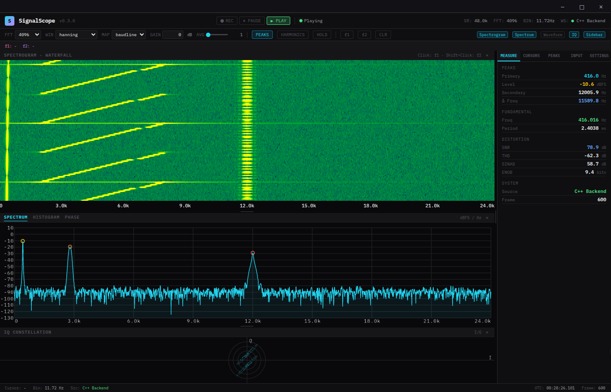

# SignalScope

A browser-class signal analyzer with a native C++ DSP backend, packaged as a
single distributable file. Spectrogram + spectrum + waveform + IQ + phase +
histogram, fed by a real-time pipeline that handles file playback, microphone
capture, and network SDR — all without the browser doing a single FFT.



---

## I want to use it

Download the latest release for your platform from the
[releases page](https://github.com/USER/REPO/releases) — single `.AppImage`,
`.exe`, or `.dmg`, no install needed. Run it. The built-in test signal
(stationary tone + sweep + pulses) launches by default so you can confirm
everything works before you point it at real input.

When you're ready for real data:

- **Microphone:** Sidebar → **Input** → `mic`. Works on Linux (ALSA/PulseAudio), macOS (CoreAudio), Windows (WASAPI) — no setup.
- **Recorded file:** Sidebar → **Input** → `file` → browse. Supports WAV, AIFF, raw float32/int8/16/24/32, and SigMF captures with center-frequency metadata.
- **Software-defined radio:** Sidebar → **Input** → `listen`. SignalScope opens a TCP port; pipe samples in from `hackrf_transfer`, GNU Radio, or anything else that speaks little-endian samples.

Detailed feature list in [manual/features.md](manual/features.md). Keyboard
shortcuts and mouse interactions in [manual/controls.md](manual/controls.md).

## I want to build / contribute

```bash
git clone <repo> && cd signalscope
chmod +x setup.sh && ./setup.sh
npm run build:backend
npm start              # production build
# or:
npm run dev            # development bundle, React DevTools, hot reload of UI changes
```

`setup.sh` handles system packages (`apt` on Linux), vendored single-header
deps, and optional uWebSockets. **Prerequisites:** Node 22+, npm, CMake 3.20+,
a C++20 compiler. Linux additionally needs `libasound2-dev` and `libpulse-dev`;
macOS and Windows audio works out of the box.

Set `SIGNALSCOPE_NO_BACKEND=1` (or pass `--no-backend`) to run the renderer
against the simulation fallback — useful for UI-only work.

Architecture overview and the three-thread backend pipeline in
[manual/architecture.md](manual/architecture.md). File tree in
[manual/project-structure.md](manual/project-structure.md).

## Highlights

- **Everything algorithmic runs on the backend.** FFT, peak detection, noise floor, A/C weighting, deep-history ring — all in C++. The renderer just draws.
- **Configurable DSP knobs.** FFT 256 → 65536, six windows, 0/50/75% overlap, multitaper K ∈ {1,2,4,8}, A/C weighting, Hilbert pre-stage, digital down-converter with tune + decimate.
- **Linear or logarithmic frequency axis.** Decade ticks, log-aware cursors, log-aware peak labels.
- **Network SDR support.** TCP listener accepts U8IQ / I16IQ / F32IQ / F32Real; works with `hackrf_transfer | nc`, GNU Radio, or anything that emits LE samples.
- **Deep history.** Backend keeps a configurable ring of full-precision dB spectrum frames; scrub back in time via plain mouse wheel on a paused spectrogram.
- **MIT-clean default build.** Header-only pocketfft FFT, no GPL dependencies. Opt-in FFTW / KFR variants exist for benchmarking.

## Documentation

| Topic | Doc |
|---|---|
| Architecture, threads, data flow | [manual/architecture.md](manual/architecture.md) |
| Binary wire protocol + commands | [manual/protocol.md](manual/protocol.md) |
| Build matrix, FFT backends, distribution | [manual/building.md](manual/building.md) |
| Running the C++ backend standalone | [manual/backend.md](manual/backend.md) |
| Test suite breakdown | [manual/testing.md](manual/testing.md) |
| Full feature list | [manual/features.md](manual/features.md) |
| Keyboard + mouse controls | [manual/controls.md](manual/controls.md) |
| Project file tree | [manual/project-structure.md](manual/project-structure.md) |

## License

MIT — see [LICENSE](LICENSE). The default build links only MIT/BSD-licensed
dependencies; the opt-in `:fftw` and `:kfr` variants link GPL v2 libraries and
are not redistributable under MIT. See [manual/building.md](manual/building.md#fft-backends) for the licensing
matrix and which artifacts stay MIT-clean.
