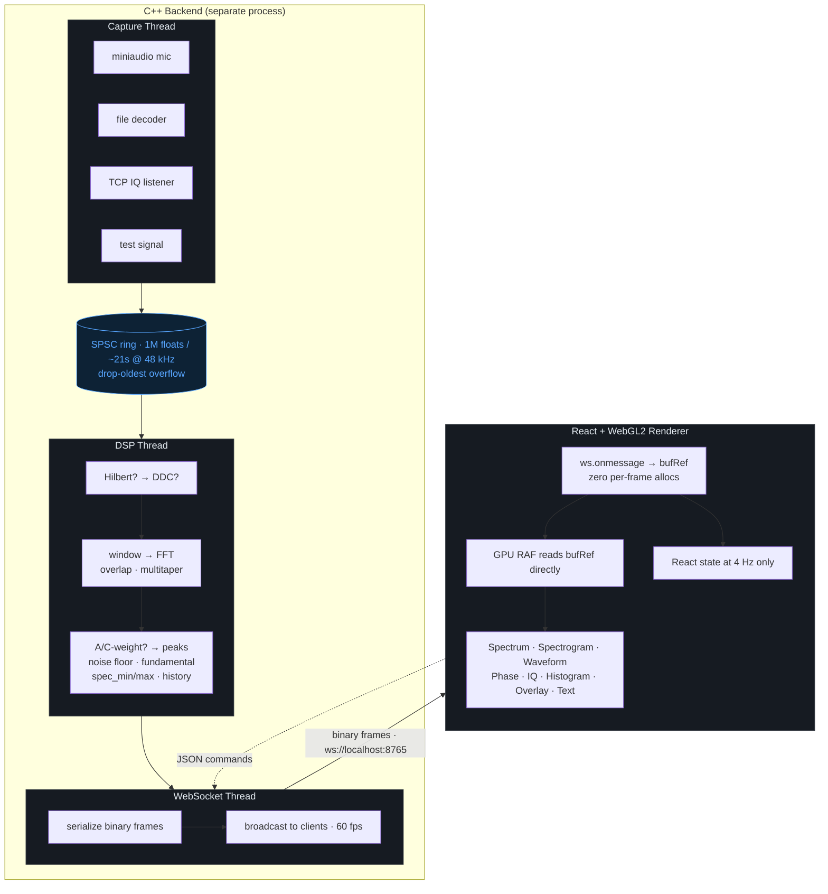

# Architecture

SignalScope splits into two long-lived processes: a native **C++ backend** that
owns every algorithmic step (capture, DSP, FFT, analytics), and an **Electron
renderer** that does layout, drawing, and user input — nothing more. They
communicate over WebSocket on `ws://localhost:8765` using a tiny binary frame
format (see [wire protocol](protocol.md)). The split lets you run either side
in isolation: launch the backend headless, connect a browser, or develop the
React UI against the simulation fallback with no backend at all.

## Process model

The backend runs as its own native process spawned by Electron's main. The renderer talks to it over `ws://localhost:8765`. Backend and renderer can also be developed independently — start the backend manually and connect any browser at the same URL.

## Three-thread backend pipeline

1. **Capture thread** — miniaudio callback (mic) or `FileSource` worker writes into a lock-free SPSC ring buffer. Never blocks; producer-side allocations are amortized to startup.
2. **DSP thread** — pulls samples, optionally runs the Hilbert pre-stage and DDC (mixer + FIR low-pass + decimator), applies a window (Hanning/Hamming/Blackman/FlatTop/Kaiser/Rectangular), runs the FFT (`r2c` for real input, `c2c` for complex) with configurable overlap and optional K-taper multitaper averaging, produces dBFS magnitude + phase, then runs the spectrum analytics: A/C-weighting (optional), peak picking, noise-floor estimate, fundamental detection, `spec_min`/`spec_max` for the renderer's Flatten auto-range, and a push into the deep-history ring. Optional peak-hold side buffer is updated when enabled. The FFT implementation is pluggable — see [FFT backends](building.md#fft-backends).
3. **WebSocket thread** — broadcasts serialized binary frames to every connected renderer at the engine target rate (60 fps default). Drains the deep-history response queue alongside the live frames.

A separate **listener thread** runs when source = `listen`: a TCP server accepts a single SDR publisher, decodes its samples (U8IQ / I16IQ / F32IQ / F32Real, all little-endian on the wire), and writes them straight into the capture ring buffer. See [`source/iq_listener.hpp`](../src/backend/source/iq_listener.hpp).

## Renderer model — heavy compute on the backend

The renderer follows the Figma/Discord model: every algorithmic step lives in C++. The browser does **layout, drawing, and user input** — nothing else. Concretely:

- **Peak detection, noise-floor, fundamental** — all in [`dsp_pipeline.hpp`](../src/backend/dsp/dsp_pipeline.hpp), sent to the renderer as a `SpectrumStats` frame.
- **Peak hold** — running per-bin max maintained on the backend; sent as a separate `SpectrumHold` frame so the spectrogram waterfall (which always uses the live trace) is unaffected.
- **DDC + Hilbert + A/C-weighting + multitaper averaging + FFT overlap** — backend-only. Renderer just sees the resulting spectrum.
- **Flatten auto-range** — the backend computes `spec_min`/`spec_max` per frame and ships them on the stats frame; the renderer just EMA-smooths and remaps the y-axis.
- **Deep-history scroll** — the spectrogram's ring lives on the backend; the renderer asks for batches of rows via a `request_history` command and the backend replies with `HistoryRow` frames carrying the offset back from newest.
- **Capture exports (WAV / AIFF / CSV / RAW)** — written directly from the backend's serialized frame buffer to a path the user picked via Electron's save dialog. PNG export is the lone renderer-side format because the pixels only exist in the canvas.

The renderer keeps a **stable preallocated buffer** that `onmessage` writes into via `.set()` — no per-frame allocations on the hot path. The GPU RAF loop reads that buffer directly. Status fields (frame ID, clipping, sample rate) are flushed to React state at 4 Hz only, so a sustained 60 fps data stream doesn't force 60 React re-renders per second. Display preferences and DSP knobs round-trip through `localStorage` so they survive reloads; transient state (cursors, pause, view zoom, deep-history scroll position) deliberately does not.

## Related docs

- [Wire protocol](protocol.md) — binary frame format and command convention
- [Project structure](project-structure.md) — where each subsystem lives in the file tree
- [Backend CLI](backend.md) — running the backend headless / standalone
- [Building](building.md) — build matrix, FFT backends, runtime dependencies
